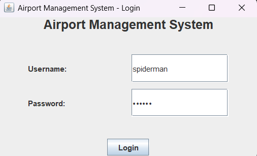
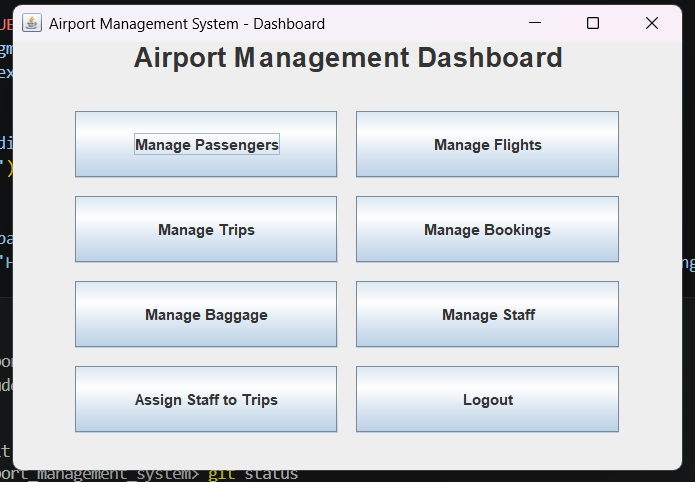
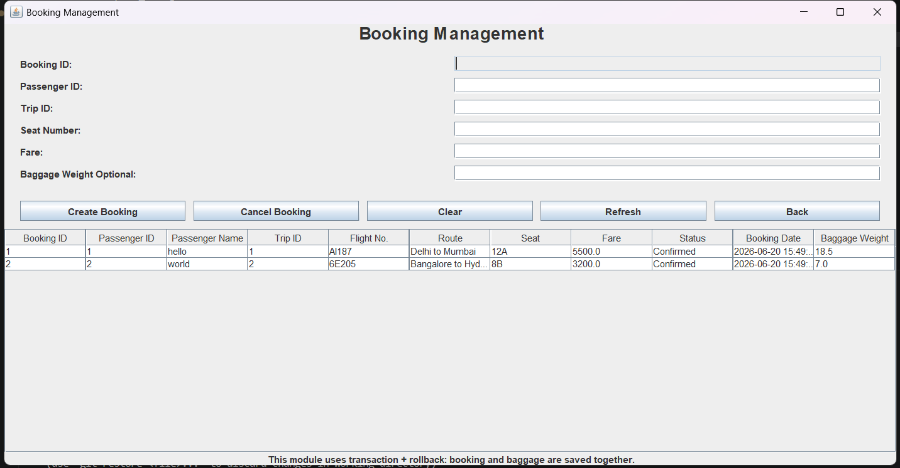
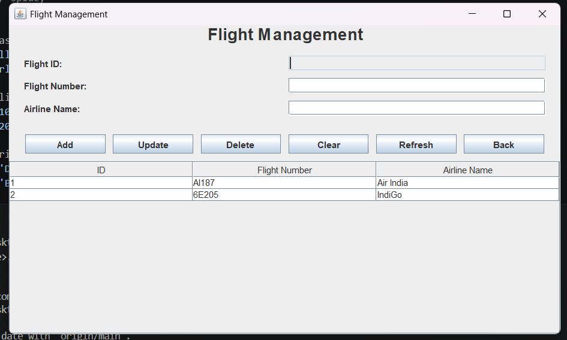
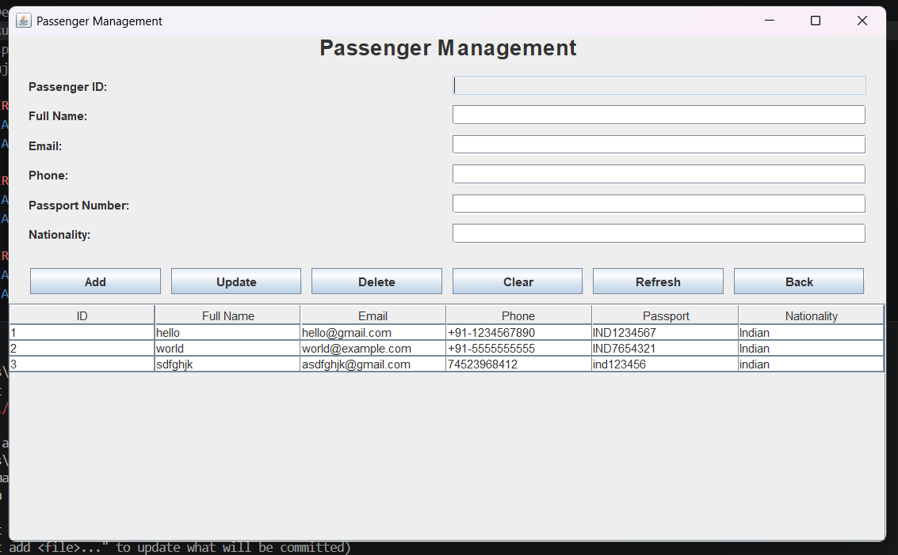
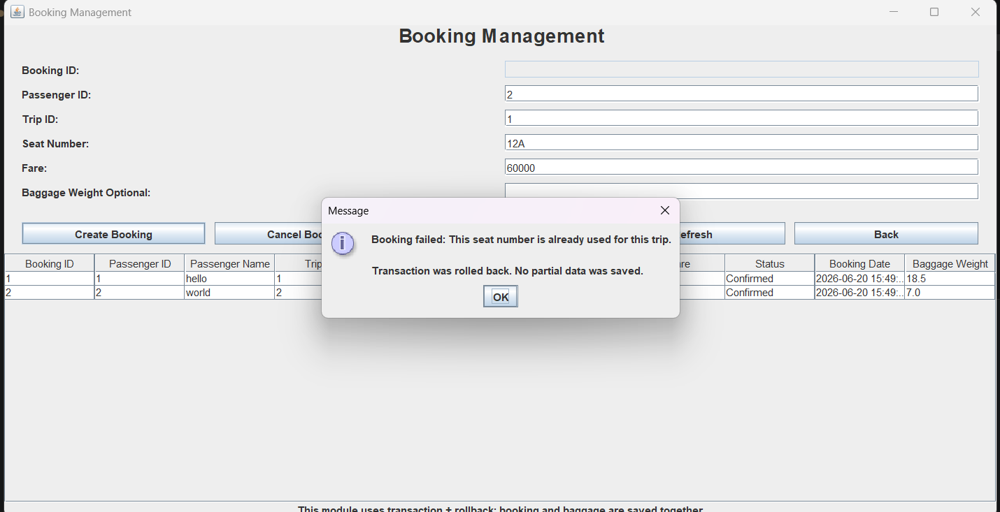
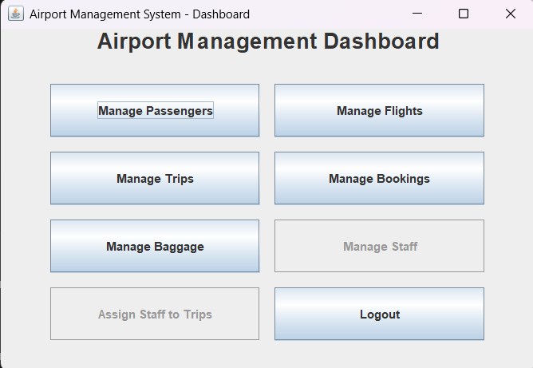
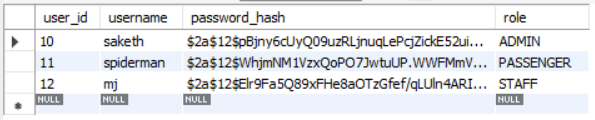

# Airport Management System

A Java-based Airport Management System built as a DBMS project. The application uses Java Swing for the interface, JDBC for database connectivity, and MySQL for storing and managing airport-related data.

## Features

* User login with role-based access
* BCrypt password hashing for secure authentication
* Passenger, flight, trip, booking, baggage, and staff management
* Trip-staff assignment using a many-to-many relationship
* Transaction-based booking flow with rollback support
* MySQL schema with primary keys, foreign keys, constraints, and normalized tables

## Tech Stack

* Java
* Java Swing
* JDBC
* MySQL
* Maven
* BCrypt

## Database Tables

The project uses the following main tables:

* `users`
* `passengers`
* `flights`
* `trips`
* `bookings`
* `baggage`
* `staff`
* `trip_staff`

## Security

Passwords are not stored in plain text. Demo users are created using `UserSeeder.java`, which hashes passwords using BCrypt before inserting them into the database.

## Transaction Handling

The booking module uses JDBC transactions. A booking and its baggage entry are saved together. If any step fails, the transaction is rolled back so that partial data is not stored.

## Setup

1. Create the MySQL database using:

```sql
source database/schema.sql;
```

2. Insert sample data using:

```sql
source database/sample_data.sql;
```

3. Set your MySQL password in PowerShell:

```powershell
$env:DB_PASSWORD="your mysql password"
```

4. Run the user seeder once:

```powershell
mvn -q "-Dexec.mainClass=com.airport.util.UserSeeder" clean compile exec:java
```

5. Run the application:

```powershell
mvn -q clean compile exec:java
```

## Demo Login

```text
Admin:
username: saketh
password: ram

Staff:
username: mj
password: mj

Passenger:
username: spiderman
password: spidey
```

## Screenshots

### Login Page


### Admin Dashboard


### Booking Management


### Flight Management


### Passenger Management


### Rollback on Failed Booking


### Staff Dashboard


### Users Table with Hashed Passwords



## Project Highlights

* Designed a normalized MySQL database schema for airport operations
* Implemented CRUD operations using Java Swing and JDBC
* Added secure login using BCrypt password hashing
* Used transaction management and rollback for booking consistency
* Implemented role-based dashboard access for admin, staff, and passenger users
